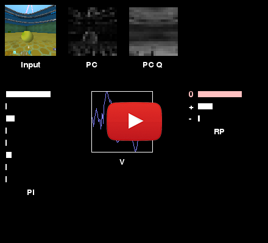
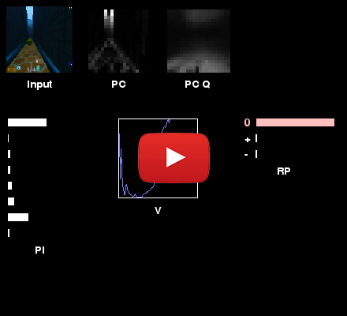
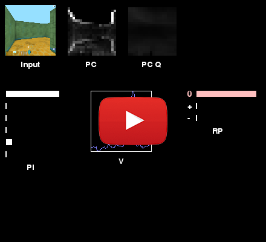
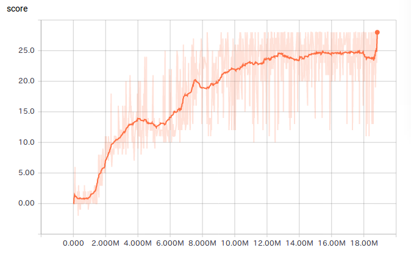
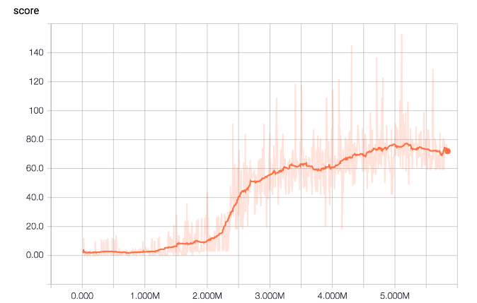

# UNREAL

## Citation
```
@article{jaderberg2016reinforcement,
  title={Reinforcement learning with unsupervised auxiliary tasks},
  author={Jaderberg, Max and Mnih, Volodymyr and Czarnecki, Wojciech Marian and Schaul, Tom and Leibo, Joel Z and Silver, David and Kavukcuoglu, Koray},
  journal={arXiv preprint arXiv:1611.05397},
  year={2016}
}
```

## Acknowledge
[miyosuda/unreal](https://github.com/miyosuda/unreal)


## About

Replicating UNREAL algorithm described in Google Deep Mind's paper [Reinforcement learning with unsupervised auxiliary tasks]
(https://arxiv.org/pdf/1611.05397.pdf)

Implemented with TensorFlow and DeepMind Lab environment.

## Preview
seekavoid_arena_01

[](https://youtu.be/1jF3gAdXfio)

stairway_to_melon

[](https://youtu.be/FDA8QqUgdbo)

nav_maze_static_01

[](https://youtu.be/xHK0qBeH3-I)

## Network


All weights of convolution layers and LSTM layer are shared.

## Requirements

- Python 2.7
- TensorFlow (Tested with 1.3)
- DeepMind Lab
- numpy
- cv2
- pygame  '1.9.3'
- matplotlib

## Result
"seekavoid_arena_01" Level



"nav_maze_static_01" Level




## How to train
First, dowload and install DeepMind Lab
```
$ git clone https://github.com/deepmind/lab.git
```
Then build it following the [build instruction](https://github.com/deepmind/lab/blob/master/docs/build.md).


Clone this repo in lab directory.
```
$ cd lab
$ git clone https://github.com/JiankaiSun-SJTU-MVIG-training/Unsupervised-Reinforcement-and-Auxiliary-Learning-in-TensorFlow.git
```
Add this bazel instrution at the end of `lab/BUILD` file

```
package(default_visibility = ["//visibility:public"])
```

Then run bazel command to run training.
```
bazel run //unreal:train --define headless=glx
```
`--define headlesss=glx` uses GPU rendering and it requires display not to sleep. (We need to disable display sleep.)

If you have any trouble with GPU rendering, please use software rendering with `--define headless=osmesa` option.

## How to show result

To show result after training, run this command.
```
bazel run //unreal:display --define headless=glx
```
